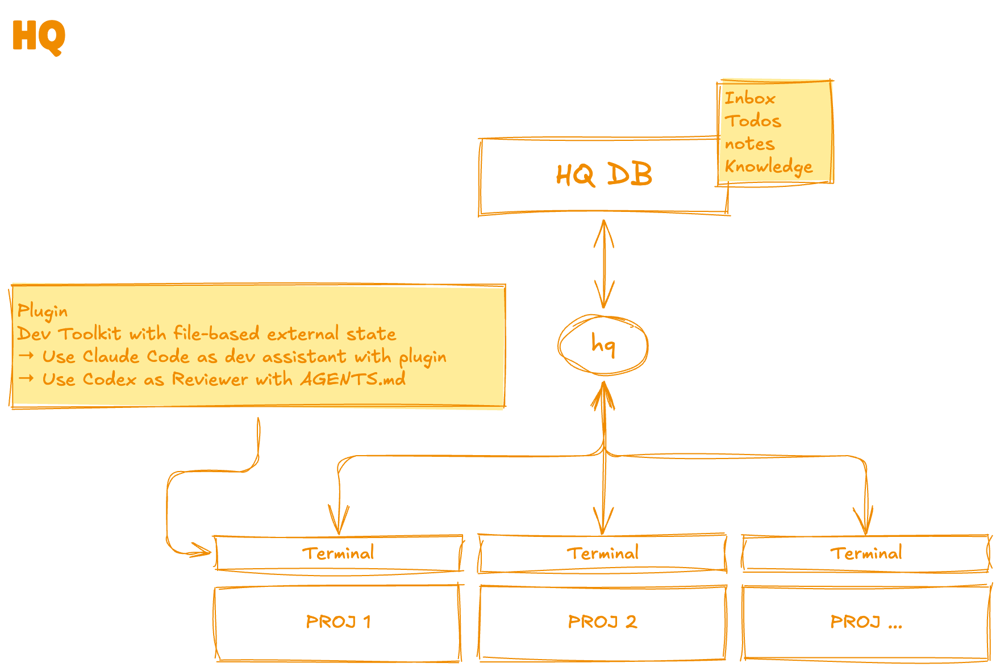

# HQ

A development hub for AI-assisted workflows across multiple projects.

Each project runs Claude Code with the HQ plugin (dev skills & commands), while a shared data store and CLI dashboard provide cross-project visibility. Codex can also act as a reviewer via AGENTS.md. All data is plain Markdown with YAML frontmatter.



## Components

### plugin/ — Claude Code Plugin

A Claude Code plugin that provides skills and commands for AI-assisted development workflows. Two versions coexist under `plugin/v1/` and `plugin/v2/`.

#### v2 (active)

Skills, agents, and commands architecture. Skills define pure analysis criteria, agents handle autonomous workflow execution, commands provide user-invoked workflow shortcuts. Core design principle: **GitHub Issue-based traceability** — all work is tracked through GitHub Issues and PRs, with `focus.md` in Claude Code memory as a local pointer to the active plan.

**Skills** (analysis criteria — invoked via `/skill-name`):

| Skill              | Description                                                                    |
| ------------------ | ------------------------------------------------------------------------------ |
| `bootstrap`        | Initialize a project (CLAUDE.md, rules, AGENTS.md, .gitignore)                |
| `pr`               | Create a pull request linked to `hq:plan` and `hq:task` issues                |
| `code-review`      | Code review criteria — readability, correctness, performance, security         |
| `security-scan`    | Security scan criteria — credentials, external comms, dynamic code, etc.       |
| `archive`          | Archive task artifacts, close `hq:plan`, escalate unresolved FB to `hq:feedback` |
| `xcodebuild-config`| Interactive xcodebuild configuration (project, scheme, device, OS)             |
| `e2e-web`          | End-to-end web verification via Playwright CLI                                 |
| `worktree-setup`   | Create a new git worktree with local file setup (.env, .claude, .hq configs)   |
| `worktree-rebase`  | Sync worktree base branch with upstream and rebase working branch              |

**Agents** (autonomous execution — launched via Agent tool):

| Agent              | Description                                                                    |
| ------------------ | ------------------------------------------------------------------------------ |
| `code-reviewer`    | Autonomous code review — reads `code-review` skill criteria, outputs report + FB files to `.hq/tasks/` |
| `security-scanner` | Autonomous security scan — reads `security-scan` skill criteria, outputs report to `.hq/tasks/` |

Agents read skill files at runtime for analysis criteria, then handle workflow integration (focus resolution, file output, traceability) independently. Both agents can run **in parallel** and in the **background**.

**Commands** (user-invoked workflow shortcuts — invoked via `/hq:command-name`):

| Command            | Description                                                                    |
| ------------------ | ------------------------------------------------------------------------------ |
| `goahead`          | Start executing the current `hq:plan` following the full workflow with highest priority |

**Traceability**

All work is tracked through GitHub Issues and PRs. The plugin uses three issue types as semi-proper nouns:

| Label | Role | Description |
|-------|------|-------------|
| `hq:task` | Requirement | **What** needs to be done. Contains the task checklist, notes, and references. |
| `hq:plan` | Implementation plan | **How** to do it. Created per branch/PR. One `hq:task` can have multiple `hq:plan` issues. |
| `hq:feedback` | Unresolved problem | Issues found during code review or E2E that couldn't be fixed in the current branch. |

**Issue hierarchy:**

```
Milestone (optional grouping)
  └── hq:task  — requirement
        └── hq:plan  — implementation plan
              ├── ← Closes → PR
              └── hq:feedback(s)  — unresolved problems
```

**How it works:**

1. Create an `hq:task` issue describing the requirement
2. Create an `hq:plan` issue with the implementation plan (references the `hq:task` via `Parent: #N`)
3. Work on a feature branch. `focus.md` in Claude Code memory points to the active `hq:plan` issue number
4. PR uses `Closes #<hq:plan>` (auto-closes on merge) and `Refs #<hq:task>` (cross-reference)
5. Unresolved review findings can be escalated to `hq:feedback` issues

**Recommended `hq:plan` issue body structure:**

```markdown
Parent: #<hq:task issue number>

## Plan
<implementation steps>

## Gates
- [ ] Completion criteria (shown as progress bar in GitHub UI)

## Verification
- [ ] E2E test items (parsed by the e2e-web skill)
```

**Prerequisites:** `gh` CLI must be authenticated (`gh auth status`).

**Key differences from v1:**

- Skills define criteria, agents handle workflow execution, commands provide workflow shortcuts
- GitHub Issue-based traceability replaces local-file-based tracking
- Code review produces FB files instead of direct code modifications
- Per-project overrides via `.hq/<skill>.md` files
- Separate `security-scan` skill (was part of `reviewer` in v1)
- `code-reviewer` and `security-scanner` agents enable parallel verification

#### v1 (legacy — frozen)

Command-driven workflow with orchestration layer. Do not modify.

The `/hq:dev` command acts as an orchestration layer, composing independent skills:

```
/hq:dev [platform]              ← command (orchestration)
    ├── dev-core/SKILL.md       ← always loaded (branch management, planning, commit conventions)
    └── dev-<platform>/SKILL.md ← loaded by platform detection or argument
```

- **Command** (`dev.md`): Explicitly reads both skills via the Read tool and delegates to the dev-core workflow
- **dev-core**: Platform-agnostic workflow. Does not assume any platform skill exists (works standalone)
- **dev-\<platform\>**: Platform-specific setup and build rules. Does not reference dev-core

No direct references exist between skills — adding or removing a platform skill only requires updating the detection table in the command.

**Skills:**

| Skill      | Description                                                                           |
| ---------- | ------------------------------------------------------------------------------------- |
| `dev-core` | Platform-agnostic development workflow — branch management, task tracking, conventions |
| `dev-ios`  | iOS/Xcode build, run, and environment configuration                                   |
| `reviewer` | Code review standards — review criteria, security alerts, reporting format            |
| `ops`      | HQ operations — TODO and notes CRUD via `hq` CLI                                      |

**Commands:**

| Command             | Description                                                                       |
| ------------------- | --------------------------------------------------------------------------------- |
| `/hq:dev`           | Start development (loads dev-core + platform skill)                               |
| `/hq:pr`            | Create or update a GitHub Pull Request                                            |
| `/hq:code-review`   | Review code changes on the current branch (includes security alert scan)          |
| `/hq:accept-review` | Evaluate code review results, commit accepted fixes, and extract follow-up issues |
| `/hq:estimate`      | Collect requirements and organize work item estimates with risks and blockers     |
| `/hq:close`         | Archive task files to `.hq/tasks/done/` and clean up branches                    |

### tools/ — HQ CLI

A Go-based CLI and TUI dashboard built with [Bubble Tea](https://github.com/charmbracelet/bubbletea).

The TUI dashboard displays a live, interactive overview in the terminal:

- **Milestones** — upcoming deadlines with remaining days
- **WIP** — tasks currently being worked on
- **Open Tasks** — unchecked items grouped by project
- **Monthly Summary** — hours breakdown by client
- **Activity Calendar** — heatmap of daily work hours

**CLI Subcommands:**

```
hq                          Launch TUI dashboard (default)
hq ui                       Launch TUI dashboard (explicit)
hq tasks                    List, add, or complete tasks
hq notes                    List, view, add, or copy notes
hq milestones               List, add, or complete milestones
hq monthly [YYYY.MM]        Show monthly time summary
```

Common flags: `--inbox`, `--project <org/project>`, `--role <role>`, `--json`, `--all`

**Build & Install:**

```bash
mise run build              # Build to tools/bin/hq
mise run install            # Build and install to ~/.local/bin/hq
```

### AGENTS.md — Codex Reviewer Demo

`AGENTS.md` is a demo configuration for using [OpenAI Codex](https://openai.com/index/openai-codex/) as an automated code reviewer. It inlines review criteria and policies so that it works standalone in any project. The canonical source for review standards is `plugin/skills/reviewer/SKILL.md`; AGENTS.md is kept in sync manually.

## Data Directory (`db/`)

HQ reads data from a `db/` directory. The path is resolved in this order:

1. `--path` flag
2. `~/.hq/settings.json` → `data_dir`
3. Walk up from cwd looking for a directory containing `db/`

### Expected Structure

```
db/
├── projects/
│   ├── _milestones.md             # Shared milestones (checkbox list with dates/recurring rules)
│   ├── _words.md                  # Word ticker entries (bullet list displayed in TUI header)
│   ├── _/
│   │   └── inbox/
│   │       ├── tasks.md           # Inbox tasks (no project association)
│   │       └── notes/             # Inbox notes
│   ├── <org>/
│   │   └── <project>/
│   │       ├── README.md          # Project metadata (frontmatter: title, repo, tags)
│   │       ├── tasks.md           # Project tasks (checkbox list)
│   │       └── notes/             # Project notes (one .md per note)
│   └── ...
└── logs/
    └── YYYY/
        └── MM.md                  # Monthly log (time entries + daily journal)
```

### Settings

**`~/.hq/settings.json`** — Global configuration:

```json
{
  "data_dir": "/path/to/hq/db",
  "sections": {
    "monthly": false
  }
}
```

`sections` controls dashboard section visibility. Set a section to `false` to hide it. Available sections: `milestones`, `wip`, `todo`, `monthly`. Omitted sections default to visible.

**`<project>/.hq/settings.json`** — Per-project configuration:

```json
{
  "base_branch": "main",
  "resources": [
    { "name": "tasks.md", "type": "tasks", "role": "tasks" },
    { "name": "backlog.md", "type": "tasks", "role": "backlog" },
    { "name": "notes", "type": "notes", "role": "notes" }
  ]
}
```

`resources` lets you define multiple task files or notes directories per project, each with a `role` that can be targeted via `--role`.

## Task & Milestone Syntax

Tasks and milestones are written as Markdown checkbox lines in `tasks.md` or `_milestones.md`.

### Basic

```markdown
- [ ] Undated task
- [x] Completed task
```

### With Deadline

Prefix with `YYYY-MM-DD`:

```markdown
- [ ] 2026-03-15 Submit report
- [ ] 2026-04-01 Release v2.0
```

### Recurring

Use `@` prefixed rules. The next occurrence is calculated automatically.

```markdown
# Every month on the 10th

- [ ] @monthly 10 Pay invoice

# Last day of every month

- [ ] @month-end Billing

# Every year on March 15

- [ ] @yearly 03-15 Tax filing

# Every week on Monday

- [ ] @weekly mon Team standup
```

**Supported rules:**

| Rule         | Format            | Example                                      |
| ------------ | ----------------- | -------------------------------------------- |
| `@monthly`   | `@monthly <day>`  | `@monthly 10` → 10th of each month           |
| `@month-end` | `@month-end`      | Last day of each month (handles 28/29/30/31) |
| `@yearly`    | `@yearly <MM-DD>` | `@yearly 03-15` → March 15 each year         |
| `@weekly`    | `@weekly <dow>`   | `@weekly mon` → every Monday                 |

Day-of-week values: `sun`, `mon`, `tue`, `wed`, `thu`, `fri`, `sat`

### WIP Tracking

`~/.hq/wip.md` tracks work-in-progress tasks across all projects. The `/hq:dev` command automatically adds entries when starting a new work branch.

```markdown
---
purpose: Track in-progress tasks
---

- org/project: Task description (branch: feat/some-feature)
- org/another: Another task (branch: fix/bug-123)
- org/solo: Task without branch
```

Each line follows the format: `- <org/project>: <description> (branch: <branch>)`

The `(branch: ...)` suffix is optional. Entries are displayed in the TUI dashboard's WIP section and should be removed manually when the work is complete.

### Monthly Log Format

`db/logs/YYYY/MM.md` contains YAML frontmatter and daily sections:

```markdown
---
title: "2026-03 Monthly Log"
month: "2026-03"
---

## 20260301

### Results

T:

- ClientA:Development: 3.0
- ClientA:Meeting: 1.0
- ClientB:Research: 2.5
```

Time entries follow the format `- Client:Category: hours`.
